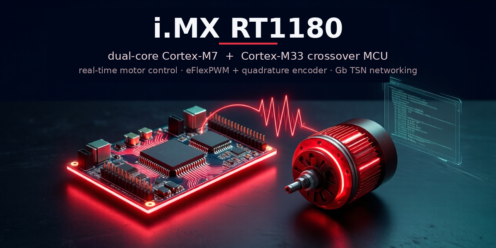

# qemu-imxrt1180



A QEMU machine model of the **NXP i.MX RT1180** crossover MCU (the fully-loaded
**MIMXRT1189** on the MIMXRT1180-EVK): a heterogeneous dual-core part pairing a
secure **Cortex-M33** boot core with a **Cortex-M7** application core, targeting
real-time **motor control** (eFlexPWM + quadrature encoder + LPADC) and **Gb TSN**
industrial networking.

- **Fork of** QEMU mainline (work on the `imxrt1180-dev` branch); all model
  logic in self-contained `imxrt1180_*` files — long-term aim: upstream-mergeable.
- **What sets it apart vs. its fleet siblings** (i.MX 91/93/95, MCXN947): the
  only crossover MCU with the M7+M33 pair and the motor-control + TSN frontier.
- **Maintainer:** @kylefoxaustin.
- **North star:** fidelity-first — a silently-wrong answer is the worst bug; a
  model is register-accurate and *flags* any gap rather than faking a result.

## Quickstart

```sh
./configure --target-list=arm-softmmu
make -j"$(nproc)"

# Boot the stock MCUXpresso SDK hello_world over the LPUART1 console:
./build/qemu-system-arm -M mimxrt1180-evk -display none -monitor none \
    -kernel hello_world_demo_cm33.bin \
    -serial stdio -semihosting-config enable=on,target=native
# -> hello world.
```

The machine auto-detects a **Cortex-M7 image** (a cm7 SDK ELF links below the M33
code TCM) and boots the M7 with its own per-core view, holding the M33 — no extra
flags. The M33 machine and every M33 test are untouched.

## What runs today

Real NXP MCUXpresso SDK firmware runs against the **unmodified `fsl_*` drivers** —
**34 / 47 `driver_examples` are byte-exact**, plus the stock audio and motor-control
demos.

| Subsystem | Tier | Evidence |
|-----------|------|----------|
| Cortex-M33 boot + memory map + NVIC (239 IRQs) | ✅ | boots bare-metal + stock SDK firmware |
| LPUART1 console | ✅ | stock `hello_world` prints `hello world.` |
| Clocks (ANADIG PLL/PFD/**AUDIO PLL**, CCM roots/gates/observe) | ✅ | real SDK `CLOCK_Init` / `GetFreqFromObs` complete |
| RTWDOG, TRDC, FlexSPI, EdgeLock ELE MU | ✅/◐ | SDK SystemInit runs to the console |
| RGPIO | ✅ | stock `led_blinky` toggles the user LED (RGPIO4[27]) |
| **Dual-core: M33 releases the Cortex-M7** | ✅ | `tests/imxrt1180-dualcore` — both cores print |
| **eDMA hardware-request path** (SAI/LPSPI/LPI2C/LPADC/eFlexPWM, both eDMA3/eDMA4) | ✅ | every trigger shape, each gate mutation-proven |
| **Audio streaming** (AUDIO PLL + WM8962 codec + SAI1-master + eDMA) | ✅ | stock `sai/edma_transfer` streams a byte-exact 1 kHz sine at 48 kHz to a wav |
| **eFlexPWM + EQDC + LPADC + PWM→XBAR→ADC sync + dq PMSM plant** | ✅ | value-verified: phase current matches Ohm's law to one ADC count |
| **LPADC A/B-side dual conversion** (`CMDL.CTYPE`) | ✅ | `tests/imxrt1180-adc-ab`, mutation-proven |
| **Cortex-M7 boots + stock cm7 `mc_pmsm/pmsm_enc` FOC demo runs** | ✅ | closed-loop FOC holds a commanded speed on the virtual PMSM indefinitely, under `-icount` (see below) |
| Ethernet (NETC / ENETC endpoint) | ✅ | real L2 over a QEMU netdev; 1180↔1180 byte-exact |
| FlexSPI NOR (`rom_device` XIP + real `m25p80`) | ✅ | erase→program→read-back byte-exact |

See [PERIPHERALS.md](PERIPHERALS.md) for the full per-block coverage table and the
honest gaps.

## Motor-control frontier: the M7 spins a virtual PMSM

The headline target is a real **field-oriented-control (FOC) loop** closing against
a virtual motor. The stock, unmodified NXP `mc_pmsm/pmsm_enc` demo — which is
**cm7-only** — now **boots on the Cortex-M7 and closes its control loop**: it walks
its state machine `Stop → Calib → Align → Startup → Spin`, and the virtual PMSM
rotor **turns under field-oriented control** (the EQDC position advances as the
speed loop tracks). Getting there exercised the whole chain end-to-end —
AUDIO/ARM PLL + FBB + DCDC bring-up, LPADC offset/gain calibration, the eFlexPWM
double-buffer commit, the LPADC A/B-side dual conversion the demo reads Ia/Ib with,
the QuadTimer 1 ms slow loop, and the EQDC hardware position-hold + speed
measurement the encoder driver reads back.

**Status: the spin is sustained.** Under `-icount` the FOC loop closes and the
virtual PMSM **holds a commanded speed indefinitely** — driven to 2000 rpm it
settles within ~1.5 % and holds flat with **zero faults**, `id ≈ 0` (textbook
field orientation), the encoder-measured speed tracking the true rotor to <0.5 %,
and the plant's mechanical speed exactly 4× the electrical (Pp = 4) as physics
demands. A commanded step (2000→1194 rpm) tracks smoothly and re-settles.

The "spurious under-voltage / load-over fault" that previously killed the spin was
**not** a plant/PI-tuning problem — it was an **LPADC RESFIFO overflow**. The FOC
fast loop reads a two-command DualBoth chain in a fixed `FIFO0/1/0/1 = Ia/Ib/dummy/
U_DCbus` order, so every PWM-synced trigger must leave exactly 2+2 entries. The
model's ADC conversion is *instant*, so without a virtual clock the trigger fires
far faster than the emulated CPU services the ADC1 ISR; the FIFO overflows, drops
entries, the grouping shifts, and **U_DCbus reads a signed phase current** (seen
swinging to −15 V) — re-latching an under-voltage fault every cycle and wedging the
drive. On silicon the conversion takes real time and the rates are matched by
physics; **`-icount` restores that** by locking the trigger rate to instruction
retirement. The model itself is faithful either way — it drops on a full FIFO and
raises `STAT.FOF`, the honest overflow flag. `tools/sdk-run.sh` enables `-icount`
automatically for `mc_pmsm`; the invariant is pinned by `tests/imxrt1180-adc-fifo-
align` (RESFIFO alignment + honest overflow, mutation-proven).

The **M33** motor path is fully value-verified (`tests/imxrt1180-motor`: rotor
aligns at the predicted encoder count, phase current matches Ohm's law to one ADC
count).

## Interconnect (board-to-board) ✅

A live b2b node on two transports:

- **Ethernet** — the NETC (ENETC endpoint) is a real QEMU NIC. 1180↔1180 verified
  byte-exact, and the RT1180 is node `0x88B6` of a **three-SoC cross-silicon L2
  segment** (see below). `tools/netc-eth-{b2b,lab3}.sh`.
- **UART** — LPUART2 @ `0x44390000` on a socket chardev (`serial_hd(1)`), matching
  the fleet's `uart-link-imx-mcx` cell, so RT1180↔MCX/91 is turnkey.
  `tests/imxrt1180-uartlink`.

Still to crib from the fleet: CAN (`can-host-chardev`), SPI (`spi-link`),
I2C (`i2c-link`) — the controllers are modelled; only the bridge wiring is left.

## Validation

- `hello_world_demo_cm33.bin` → `hello world.` over LPUART1 (full board init).
- `led_blinky` → RGPIO4[27] toggles (observable in PDOR).
- `tests/imxrt1180-dualcore` → M33 releases M7; both cores print.
- `tests/imxrt1180-cm7boot` → a cm7 image boots on the M7 and proves its per-core
  ITCM/DTCM/background view is live (mutation-proven).
- `tests/imxrt1180-motor` / `-adc-ab` → dq plant physics, phase-current golden,
  and the LPADC A/B dual conversion (mutation-proven).
- `tests/imxrt1180-corpus/run.sh` → boots every prebuilt SDK cm33 demo, reports
  pass / run / fault.

## Required artifacts

This is an MCU, not a Linux applications processor — so instead of a kernel /
DTB / rootfs, the "artifact" is **firmware**: a bare-metal, Zephyr, or
MCUXpresso image (`-kernel <elf|bin>`).  The SDK's prebuilt `cm33/*.bin` demos
work directly; RAM/debug images link their vector table to the code TCM
(`0x0FFE0000`). A **cm7** image (links to the M7's local ITCM at `0x0`) is
auto-detected and boots the M7. Build SDK examples from source with
`west build -b evkmimxrt1180 --toolchain armgcc <example> -Dcore_id=cm33|cm7
--config debug` (`--config debug` links to TCM; see `tools/sdk-run.sh`).
_(Linux/DTB/rootfs rows: N/A — no Linux on this MCU.)_

## Building

`./configure --target-list=arm-softmmu && make -j"$(nproc)"`, then
`./build/qemu-system-arm -M mimxrt1180-evk ...`.  Requires the usual QEMU build
deps; the bare-metal tests use `arm-none-eabi-gcc`.

## Architecture

`hw/arm/imxrt1180_soc.c` builds the SoC (dual ARMV7M cores, memory map, catch-all
peripheral window, then the modelled peripherals); `hw/arm/imxrt1180_evk.c` is the
thin board.  Each peripheral is a self-contained `imxrt1180_*` device under
`hw/{char,misc,gpio,ssi,i2c,audio,timer}/`.

Two ways the **M7** comes up:

- **M33-released** (the silicon path): the M33 firmware releases the M7 through
  `SRC` / `BLK_CTRL_S_AONMIX`, and the M7 boots from a system-view image — this is
  what `tests/imxrt1180-dualcore` exercises.
- **Direct cm7 boot** (`boot-cm7`, opt-in, auto-detected from the ELF): the M7 gets
  its own per-core memory view (local ITCM @ `0x0` + DTCM @ `0x20000000` overlaid on
  the SoC background), the M33 is held, and peripheral IRQs route to the boot core —
  so a standalone cm7 image (with no M33 to release it) runs its own interrupts.

## Repository tour

- `hw/arm/imxrt1180_{soc,evk}.c` — SoC + board (incl. the `boot-cm7` M7 path)
- `hw/char/imxrt1180_lpuart.c` — console / B2B UART
- `hw/misc/imxrt1180_{anadig,ccm}.c` — clock tree (PLLs incl. AUDIO PLL, roots, gates)
- `hw/misc/imxrt1180_{pwm,eqdc,adc,motor,xbar}.c` — the motor-control frontier (eFlexPWM, encoder, LPADC, dq PMSM plant, XBAR)
- `hw/{misc/imxrt1180_sai,audio/wm8962}.c` — SAI + WM8962 codec (audio streaming)
- `hw/timer/imxrt1180_{tmr,lptmr}.c` — QuadTimer + LPTMR
- `hw/misc/imxrt1180_{rtwdog,s3mu,flexspi,src,trdc}.c` — watchdog, ELE MU, FlexSPI, M7-release, TRDC
- `hw/{ssi,i2c}/imxrt1180_{lpspi,lpi2c}.c` — SPI / I2C
- `hw/gpio/imxrt1180_rgpio.c` — GPIO
- `tests/imxrt1180-*/` — bring-up, dual-core, cm7-boot, FOC, DMA, audio + saturation tests
- `include/hw/*/imxrt1180_*.h` — headers

## Cross-silicon: three SoCs on one wire ✅

`tools/netc-eth-lab3.sh` — the RT1180 is node **`0x88B6`** of a three-node raw-L2
segment with [`mcxn947qemu`](https://github.com/kylefoxaustin/mcxn947qemu) and the
i.MX 95 model. **Verified live, 2026-07-12:**

```
ENET-LAB3 rx: peer ethertype 0x88b5 src 02:4d:43:58:00:01   <- MCXN947 (Cortex-M33, ENET-QoS)
ENET-LAB3 rx: peer ethertype 0x88b7 src 02:49:4d:58:95:01   <- i.MX 95 (Cortex-A55, Linux, ENETC)
ENET-LAB3 PASS: saw BOTH peers on the segment
```

Three QEMU machine models, three different Ethernet MAC IPs (ENET-QoS / NETC /
ENETC), two architectures, two bare-metal Cortex-M33s and a Linux Cortex-A55 —
each running its own vendor firmware, exchanging real L2 frames. Each node must
observe **both** others by EtherType before it passes; a node swimming in traffic
from one peer **refuses** the milestone. That assertion declined a green four
times before it earned one.

Building the node also found a NETC bug **no two-node test can reach**: a QEMU
`can_receive()` returning false stalls the RX queue *permanently* unless the
device calls `qemu_flush_queued_packets()`. Two nodes boot together, so the window
never opens — it opens only for a node joining traffic **already in flight**.

## How this model is validated

A model that *runs* is not a model that is *right*. Two rules, both learned the
hard way (see `CLAUDE.md`):

- **Tests must compare a value to an independently-derived expected value.**
  "An IRQ fired", "a VALID bit was set", "it's within a range" proves nothing —
  **a range is not a golden**. The phase current is checked against Ohm's law
  (matches to *one ADC count*); the PWM period against SysTick, an Arm core timer
  outside the model; NOR programming against real erase/program physics; register
  reset values against the Reference Manual, not the model (that oracle caught the
  LPADC `VERID` — a wrong *constant*, not logic, that blocked the FOC demo).
- **A test that cannot fail is decoration, and you cannot tell by reading it.**
  `tools/mutation-audit.sh` corrupts the model on purpose and requires each test
  to notice. When it was first run, **3 of 4 tests did not** — the whole FOC path
  was blind. Goldens are also **swept across shapes**, because a model can be
  right at one prescaler and wrong at another. (A recurring trap the fleet now
  gates against: a *green from a stale binary* — a build that silently failed and
  left the last-good artifact in place — is a weak oracle wearing a disguise.)

## Known limitations

Honest gaps, per-block, are in [PERIPHERALS.md](PERIPHERALS.md); `(flagged)` is
defined there and means *visible to the guest*, never "we wrote a host log".

- **FOC demo requires `-icount`**: the cm7 `mc_pmsm` FOC loop closes and the rotor
  holds a commanded speed indefinitely (see the frontier section above) **only under
  a virtual clock** — the LPADC conversion is modelled as instant, so free-running it
  overflows the RESFIFO and the mc_pmsm read chain mis-aligns. `tools/sdk-run.sh`
  enables `-icount` for `mc_pmsm` automatically; `tests/imxrt1180-adc-fifo-align`
  pins the FIFO invariant. Free-running (no `-icount`) is honest, not silent — the
  ADC raises `STAT.FOF` — but the FOC loop will fault.
- **TRDC** does not enforce access control (grants everything).
- **EdgeLock (ELE)**: the enclave is proprietary and not modelled. Its **RNG is
  real** (genuine `qemu_guest_getrandom` entropy DMA'd to the guest). **Every
  other crypto command returns a failure status to the guest and leaves the
  result buffer untouched** — it does not compute, and it says so.
  > ⚠️ This README previously claimed the enclave *"never fabricates a crypto
  > result"*. **That was false.** The model answered *every* ELE command with
  > `RESPONSE_SUCCESS`, so `ELE_RngGetRandom()` returned `kStatus_Success` over an
  > un-written buffer — firmware would have seeded a crypto stack with un-computed
  > data and believed it succeeded. Fixed 2026-07-12. The false claim is left
  > visible rather than quietly deleted.
- **ASRC** (sample-rate converter) data path is not modelled (its AUDIO-PLL + codec
  blockers are now done).
- **NETC switch (SW0)**: the **NTMP command-BD ring + L2 tables + source-MAC
  learning** are modelled — the `fsl_netc_switch` driver programs the switch's
  tables through the command BD ring (`CBDRPIR` doorbell → process BD → `CBDRCIR`
  completion), and both the **forwarding database** (FDB, `{MAC,FID}→portBitmap`)
  and the **VLAN filter table** (VF, `VID→{FID, port membership}`) round-trip
  add/query/delete. A frame ingressing the switch (CPU-injected on the management
  port, or arriving from the wire) has its **source MAC learned** into a dynamic
  FDB entry, exactly as silicon populates its database from live traffic
  (`tests/imxrt1180-netc-fdb`, mutation-proven). The **PTP 1588 timer** (TMR0) is
  a nanosecond clock derived from the QEMU virtual clock, whose rate the driver
  tunes via the addend — the clock advances, doubling the addend doubles the rate,
  and clearing `TE` freezes it (`tests/imxrt1180-netc-ptp`, mutation-proven,
  `-icount`). And the switch **forwards**: a CPU-injected frame is egressed per the
  FDB — the forwarding-decision engine does the FDB∩VLAN-membership lookup, floods
  an unknown-unicast/broadcast, and applies split-horizon, so a frame reaches the
  wire only when its destination resolves there (observed via the wire port's
  `PM0_TFRMN` transmit counter; `tests/imxrt1180-netc-fwd`, mutation-proven).
  Forwarding is **symmetric**: a frame arriving from the wire is delivered to the
  CPU only when its destination resolves to the management port — a known unicast
  destined elsewhere is switched away, while an unknown-unicast/broadcast floods
  and is delivered (`tests/imxrt1180-netc-rxfwd` proves this over a QEMU mcast
  socket with a sentinel-barrier oracle; the lab3 3-node broadcast segment still
  passes). The **real NXP `netc_switch` SDK example** (the unmodified
  `fsl_netc_switch` driver) runs its whole **control-plane bring-up** on the model
  — `EP_Init` on the ENETC1 management SI, the seven port-MAC software resets,
  per-port RTL8211F PHY link-up, `SWT_Init` (switch + bridge + command-BD-ring
  config) and `SWT_ManagementTxRxConfig` return success, and the demo reaches its
  MAC-learning frame send — validating the NTMP/FDB/VLAN/port/management modeling
  against the real driver. It stops at the **data-plane frame path**: `SWT_SendFrame`
  drives the switch's *management* TX BD ring (on ENETC1's SI), which the model does
  not yet DMA/forward, so the TX never completes. **Not yet modelled**: that
  management TX/RX frame path (and true multi-physical-port routing — the model has
  one wire port), and the per-VLAN MAC-learning-options. Unmodelled tables fault
  honestly via the BD's `resp.error`, never a silent ack.
- **Cache** is a QEMU-architectural WONTFIX (no guest CPU cache to model); **MECC**
  is an optional RAS diagnostic.

Two limitations this README used to list are now **CLOSED**: the *clock tree*
(every timer once ran at a hardcoded, wrong constant — see the retraction below),
and the *LPADC A/B input side* + *audio subsystem*, both of which the motor-control
and audio-streaming work above now cover.

> **The clock-tree gap, because it was worse than the old text admitted.**
> Every timer in the machine ran at a hardcoded constant, and **not one of the six
> was right**: GPT 10× slow, LPIT/TPM 5.5× slow, LPTMR 3.3× slow, QTMR 1.8× fast,
> eFlexPWM **1.5× fast**. The PWM value-golden *passed the whole time*, because it
> took `PWM_HZ` **from the model** and said so in its own comment: *"if PWM_CLK were
> wrong, this golden would be wrong in exactly the same direction and still pass."*
> It was, and it did. **A mirror that declares itself is still a mirror.** The golden
> is now anchored on the clock root the firmware programs and sweeps the divider, so
> a model that ignores the clock tree fails it. Gates: `tests/imxrt1180-clocktree`
> (exact Hz, 42 combinations) and the re-anchored `tests/imxrt1180-pwm`.

## Roadmap

1. **NETC switch path** — the SW0 NTMP command-BD ring, FDB + VLAN-filter tables,
   source-MAC learning, the PTP 1588 timer, and **bidirectional** (CPU↔wire) FDB
   forwarding now land; what remains is **true multi-physical-port routing** (more
   than one wire port, needing a multi-netdev structure); finish the 3-node raw-L2
   segment.
2. Saturation/thermal effects and a time-varying load profile in the motor plant;
   the ASRC data path.
3. Value-golden a peripheral **through the real `fsl_*` driver** rather than by
   poking registers — the one rung-3 clause we do not yet satisfy everywhere.

## License

GPL-2.0-or-later (QEMU).  Upstream QEMU documentation: see `README.rst`.
